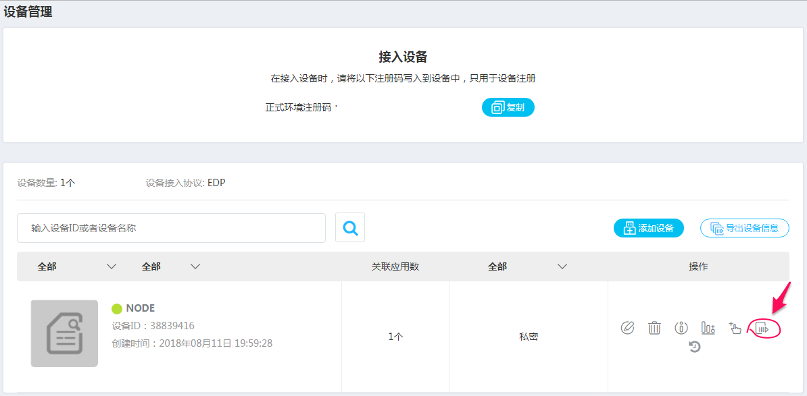
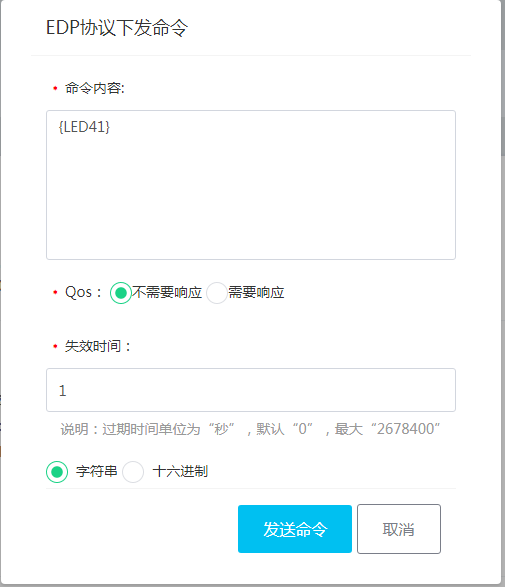
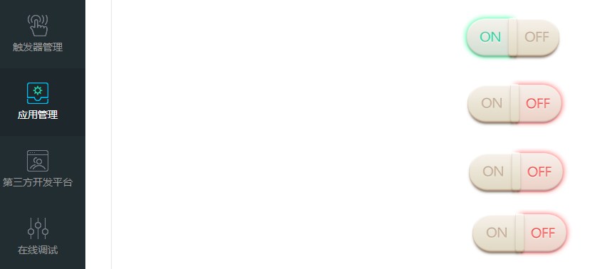

## ONENET读取与控制麒麟座MINI开发板LED状态

### 硬件

麒麟座MINI开发板V1.4

 

### 嵌入式软件

OneNET_Demo_ESP8266_EDP_Led

 

### 工程修改内容

1. led.c文件修改
   * 函数LED_Init，mini开发板LED所在GPIO为PB6、PB7、PB8、PB9
   * 函数LED_GetValue，mini开发板LED状态与IO口状态相反

```C
/**
  * @brief  LED指示灯初始化函数
**/
void LED_Init(void)
{
    GPIO_InitTypeDef GPIO_InitStructure;
    //PB9--对应开发板红色指示灯;PB8--对应开发板绿色指示灯;
	//PB7--对应开发板黄色指示灯;PB6---对应开发板蓝色指示灯
    RCC_APB2PeriphClockCmd(RCC_APB2Periph_GPIOB, ENABLE);
    GPIO_InitStructure.GPIO_Pin = GPIO_Pin_6|GPIO_Pin_7|GPIO_Pin_8|GPIO_Pin_9;
    GPIO_InitStructure.GPIO_Speed = GPIO_Speed_50MHz;
    GPIO_InitStructure.GPIO_Mode = GPIO_Mode_Out_PP;
    GPIO_Init(GPIOB, &GPIO_InitStructure);
}

/**
  * @brief  获取LED的当前状态值
**/
void LED_GetValue(void)
{
		if(GPIO_ReadOutputDataBit(GPIOB, GPIO_Pin_9))
		{
				red_value=0;
		}
		else
		{
				red_value=1;
		}
		if(GPIO_ReadOutputDataBit(GPIOB, GPIO_Pin_6))
		{
				blue_value=0;
		}
		else
		{
				blue_value=1;
		}
		if(GPIO_ReadOutputDataBit(GPIOB, GPIO_Pin_8))
		{
				green_value=0;
		}
		else
		{
				green_value=1;
		}
		if(GPIO_ReadOutputDataBit(GPIOB, GPIO_Pin_7))								
		{
				yellow_value=0;
		}
		else
		{
				yellow_value=1;
		}
}

```


2. led.h文件修改

```C
#define  LED_RED_OFF       GPIO_SetBits(GPIOB,GPIO_Pin_9)
#define  LED_GREEN_OFF     GPIO_SetBits(GPIOB,GPIO_Pin_8)
#define  LED_YELLOW_OFF    GPIO_SetBits(GPIOB,GPIO_Pin_7)
#define  LED_BLUE_OFF      GPIO_SetBits(GPIOB,GPIO_Pin_6)

#define  LED_RED_ON        GPIO_ResetBits(GPIOB,GPIO_Pin_9)
#define  LED_GREEN_ON      GPIO_ResetBits(GPIOB,GPIO_Pin_8)
#define  LED_YELLOW_ON     GPIO_ResetBits(GPIOB,GPIO_Pin_7)
#define  LED_BLUE_ON       GPIO_ResetBits(GPIOB,GPIO_Pin_6)
```

3. ESP8266.h文件修改

```c
#define API_KEY     "DXZcCKxqrpxZJKWFnbMzxIjeITk="  //API_KEY 需要修改为用户自己的对应参数
#define DEV_ID      "1078702"                       //设备ID  需要修改为用户自己的对应参数
#define CWJAP       "AT+CWJAP=\"ONENET\",\"\"\r\n"	//ssid: onenet 密码：空
```

​	前两个宏定义OneNET平台相关，最后一个WIFI的SSID名称以及密码，这三个宏根据自己的需要修改

 

### OneNET平台操作

1. 设置GPIO状态








上述命令实现点亮blue led

2. 读取GPIO状态



 目前显示BLUE点亮，其他三个LED熄灭

 

### 参考

  1. https://github.com/cm-heclouds/OneNET_demo_code_kylin/tree/master/OneNET_Demo_ESP8266_EDP_Led
 2. https://github.com/cm-heclouds/OneNET_demo_code_kylin/blob/master/OneNET_Demo_User_Guide.pdf
 3. C:\Users\zhenglili\Desktop\Remote SVN\11_Communication_Protocol\01_OneNet\01_reference\平台初入门.pdf